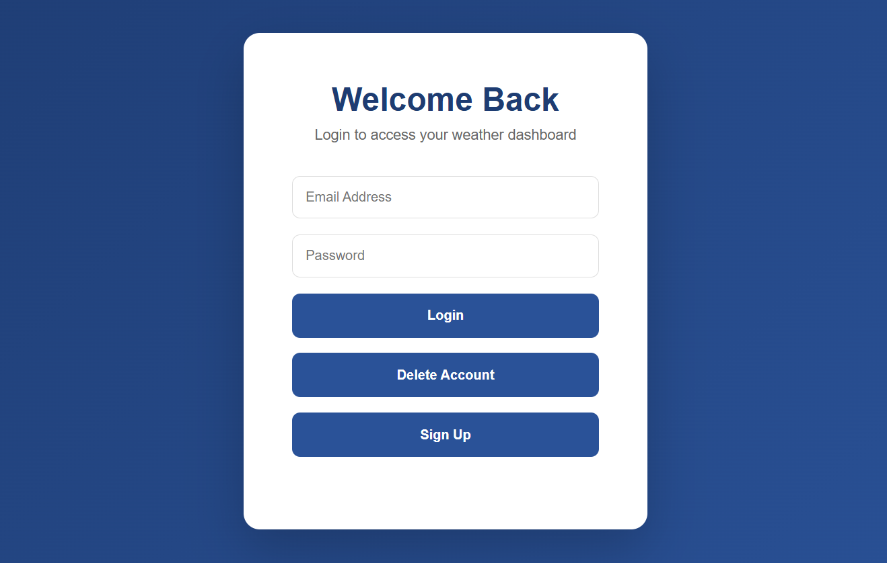
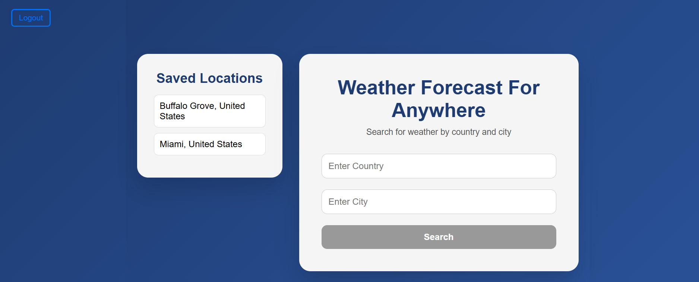
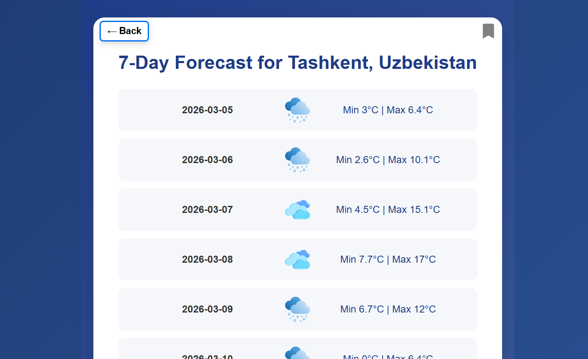

<!-- README.md is generated from README.Rmd. Please edit that file -->

# Weather Dashboard

## By: Saul Varshavsky

<!-- badges: start -->
<!-- badges: end -->

### Project Description

This project aims to create a weather dashboard that allows users to search for a given city in a given country and view its forecasted weather.

#### Note the following:
The Weather Forecast API from Open-Meteo is used for retrieving predicted weather information for a given city in a given country.

The Nominatim API (https://nominatim.org/) is used for providing auto suggestions as the user starts
typing a given country and given city.

### Project Setup

- **Installing Node.js**:
  - Go to nodejs.org
  - Click on the "Download" tab in the navigation bar
    - Select the latest LTS version 
        - e.g. v24.14.0 (LTS)
    - Select npm
  - Download Node.js and follow the installation instructions
    - Make sure Node.js is stored where the rest of your program files
    - Copy that path
        - e.g. C:\Program Files\nodejs\
  - Once Node.js is installed, go to where your environment variables are stored
    - e.g. For Windows, start typing "enviro....." in the search bar; select "Edit the system environment variables" (i.e. Control panel)
    - Select the tab "Environment Variables..."
    - From there, you'll see a table-like section at the top under the label "User variables for userName". Double click where it says "Path".
        - e.g. "User variables for sbvar"
    - Double click on the blank row directly after the last path; then paste the path you copied
  - Restart VS Code

- **Installing Next.js**:
  - Go to nextjs.org
  - Click on the "Docs" tab in the navigation bar
  - Navigate to the Installation guide to help with following the instructions associated with npm

- **Setting Up Next.js in your Visual Studio Code terminal**:
  - npx create-next-app@latest project-name (e.g. project-name = weather-dashboard)
  - Select "No, customize settings"
  - No (use Typescript)
  - Select to use ESLint
  - Yes (use React Compiler)
  - Yes (use Tailwind CSS)
  - Yes (use src directory)
  - Yes (use App Router)
  - No (customize default import alias)

- **Getting Extensions in Visual Studio Code**:
  - Tailwind CSS IntelliSense extension by Tailwind Labs
  - ES7 + React/Redux/React-Native snippets extension by dsznajder
  - JavaScript and TypeScript Nightly by Microsoft

- **Install additional packages**:
  - npm install openmeteo (Weather Forecast API)
  - npm install react-icons (For Better UI)

- **Run your web application**:
  - npm run dev
    - use the http://localhost:3000/login url

### File Descriptions

- **Webpage Design**:
  - src/app/login/page.js - Login Page
  - src/app/signup/page.js - Signup Page
  - src/app/dashboard/search/page.js - Weather Search Page
  - src/app/dashboard/result/page.js - Weather Dashboard Page

- **Webpage Styling**:
  - src/app/globals.css - Ensuring a consistent UI design
  - src/app/login/login.module.css - Login Page
  - src/app/signup/signup.module.css - Signup Page
  - src/app/dashboard/search/dashboard-search.module.css - Weather Search Page
  - src/app/dashboard/result/dashboard-result.module.css - Weather Dashboard Page

- **Data Storage**:
  - src/data/users.json - Stores User Info

- **API Routes**:

  ***The API routing associated with the Weather Forecast API and the Nominatim API is integrated directly into the Weather Search Page and Weather Dashboard Page***
  - src/app/api/auth/login/route.js - Login Page
  - src/app/api/auth/signup/route.js - Signup Page
  - src/app/api/auth/delete/route.js - Deletes Given User Info
  - src/app/api/save/save-result/route.js - Saves the user's search result
  - src/app/api/save/get-saved-result/route.js - Retrieves the saved user's search result

- **Weather Icons**:

  ***Used Flaticon to get the weather icons***
  - public/weather-icons/sunny.png - Sunny Weather
  - public/weather-icons/cloudy.png - Cloudy Weather
  - public/weather-icons/sunny-cloudy.png - Partly Sunny and Partly Cloudy Weather
  - public/weather-icons/rainy.png - Rainy Weather
  - public/weather-icons/stormy.png - Stormy Weather

### Trade Offs and Assumptions

- Instead of using a NoSQL database to store user information, I used a JSON file given the time constraints.

- Originally, I wanted to provide feedback to the user indicating when both their email and password are incorrect. By doing this, I wanted to let the user know that they don't have any account; they need to go ahead and create one. However, I ended up simply indicating whether the user's email or password was incorrect. If both the user's email and password were incorrect when signing in, then they would be notified that their email was incorrect.

- Rather than checking if the country and city the user entered were accurate, I pivoted a different direction. I utilized the Nominatim API to provide auto suggestions to the user as they typed a country and city. By going in this direction, I assumed that the Nominatim API would ensure that the user typed in an actual country and city.

### Future Work

- Currently, only the minimum and maximum temperatures for a given day for a given country and city is displayed. However, it would be nice to implement an hourly forecast, showing the forecasted temperature for each hour of the day. This would be an additional feature to the minimum and maximum temperatures.

### Project Screenshots

